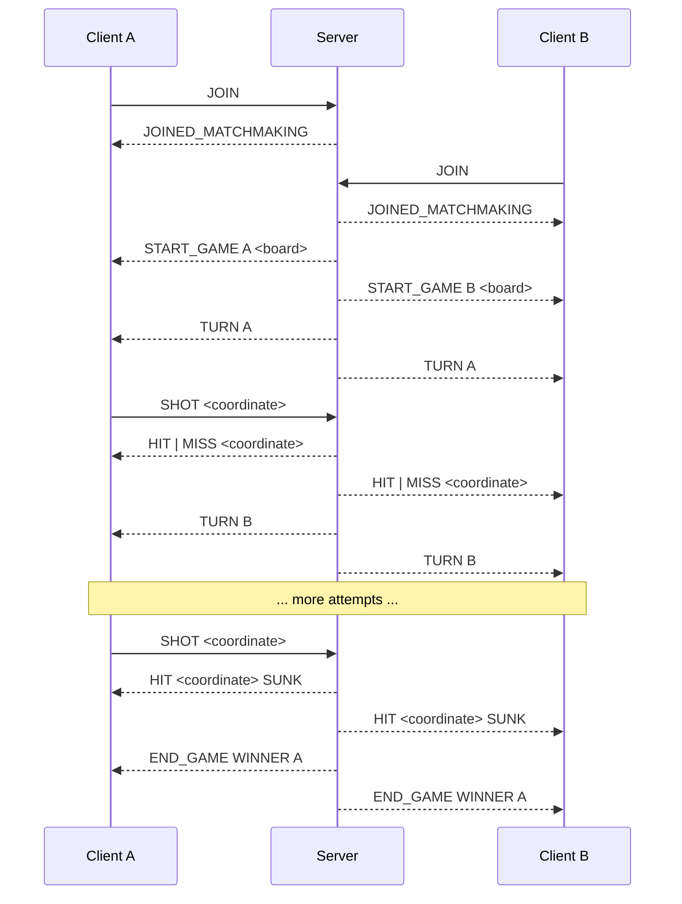
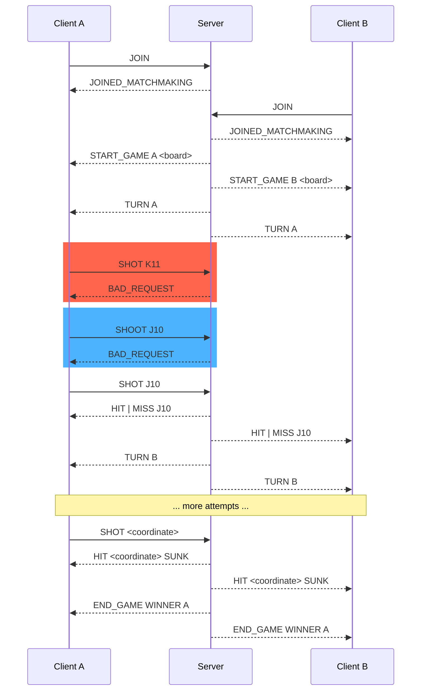
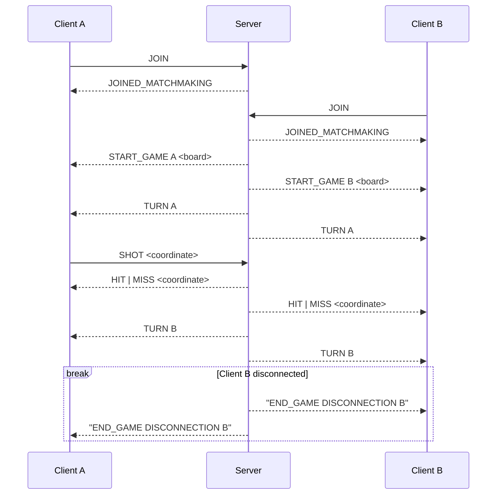
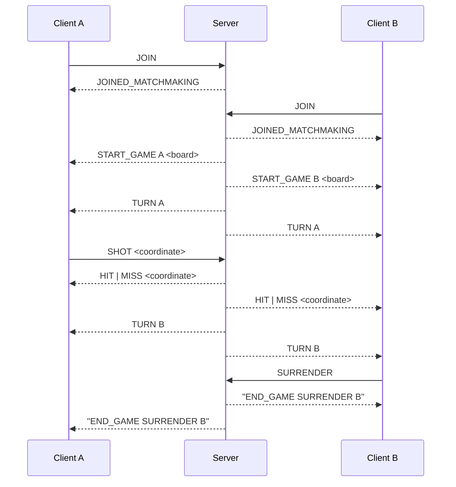
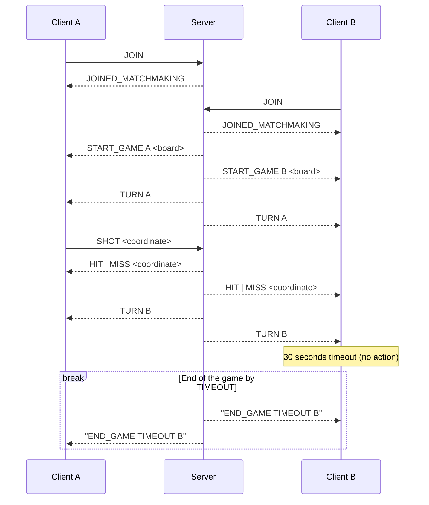
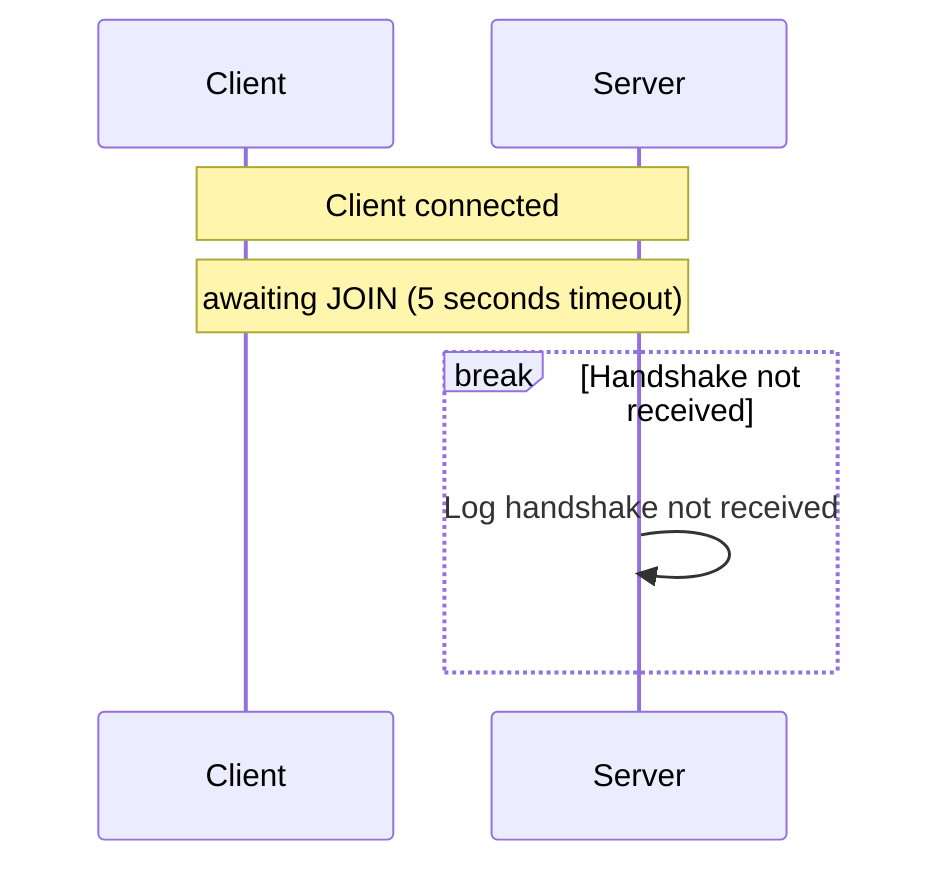
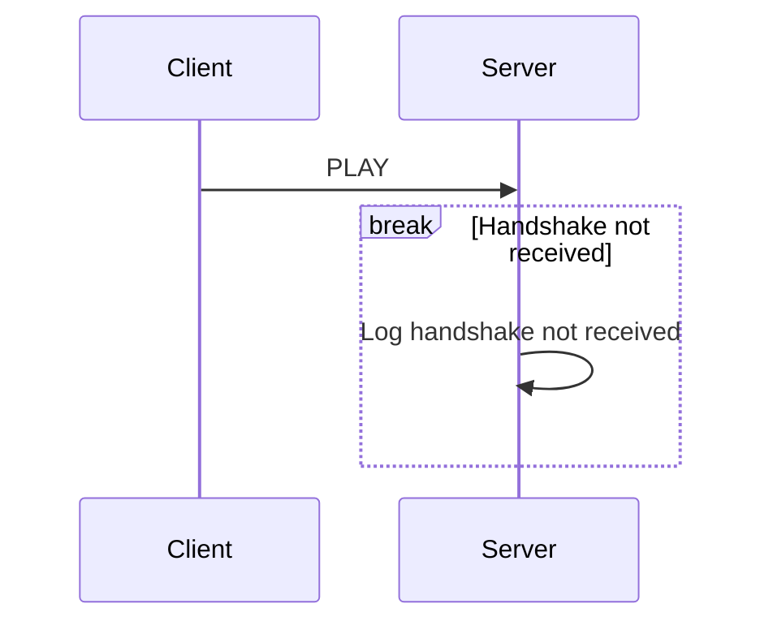

<h1>Battlesocket</h1>
<!-- As HTML tag to prevent it from being included in header numbering. -->

An online multiplayer implementation of the popular Hasbro strategy game. We are
meant to design and implement an application-layer protocol as well as get
ourselves accustomed to the Unix sockets interface.

## 1. Architecture

> [!WARNING]
>
> Pending.

### 1.1. Sequence diagram

> [!WARNING]
>
> Pending.

### 1.2. Class diagram

> [!WARNING]
>
> Pending.

## 2. Protocol

> [!WARNING]
>
> This section is incomplete.

The BattleShip Protocol (BSP) is an application-layer
network communication protocol for Battleship game.
BSP relies on TCP to exchange human-readable text messages
that allow information sharing and event synchronization
between a game server and its clients.

This section defines the semantics of BSP
messages, as well as the procedures regarding them.

### 2.1. Vocabulary

Following the convention suggested in the instructions handout, the BSP messages
follow the structure:

    message = message_type data LF

where LF acts as the message terminator.

Since our game relies on a client-server architecture, some of the messages are
specific to either client or server, and not to its counterpart. Even though, in
theory, a client could send a server-specific message, the protocol procedures
make sure that such cases are handled correctly.

We define some common symbols that are used in the following sections:

    player_letter = "A" | "B"

    coordinate = row col
    row = "A" | "B" | "C" | "D" | "E" | "F" | "G" | "H" | "I" | "J"
    col = "1" | "2" | "3" | "4" | "5" | "6" | "7" | "8" | "9" | "10"

#### 2.1.1. Shared by client and server

#### 2.1.2. `BAD_REQUEST`

Any malformed request (that is, one that is not a valid message of BSP), is
replied to with a `BAD_REQUEST` message.

    bad_request = "BAD_REQUEST"


#### 2.1.3. Server-to-client

##### 2.1.3.1. `JOINED_MATCHMAKING`

When a client joins a game server, we send the following message:

    joined_matchmaking = "JOINED_MATCHMAKING"

##### 2.1.3.2. `START_GAME`

When a game room has been filled, i.e., there are two clients connected, the
server sends a notification to both of them, specifying their letters
and each player's board:

    start_game = "START_GAME" player_letter "{ (ship_type)":""}"

> [!WARNING]
>
> This section is incomplete.

##### 2.1.3.3. `END_GAME`

When a game ends the server notifies each client of the reason for ending
the game. These are the possible reasons to end a game:

1. a player won the game

2. a player disconnected from the server

3. a player sent a surrender message to the server

4. a player didn't send a valid action message on time and thus timed out

Thus we have these possible messages:

    end_game = "END_GAME" cause player_letter
    cause    = "WINNER" | "SURRENDER" | "DISCONNECTION" | "TIMEOUT"

##### 2.1.3.4. `HIT`

When a shot sent by the client results in a hit, the server sends this message
to notify each client of a board update:

    hit = "HIT" coordinate | "HIT" coordinate "SUNK"

##### 2.1.3.5. `MISS`

Similarly, when a shot sent by the client does _not_ result in a hit, the server
sends this message to notify each client of a board update:

    miss = "MISS" coordinate

##### 2.1.3.6. `TURN`

When a player shot sent by a client is processed, it tells both players who
goes next through the following message:

    turn = "TURN" player_letter

#### 2.1.4. Client-to-server

##### 2.1.4.1. `JOIN`

> [!WARNING]
>
> Not fully implemented. Still missing the nickname

A client that wants to connect to a BSP server must send a handshake message to
verify that it's a BSP client and prevent unwanted connections:

    join = "JOIN" nickname

##### 2.1.4.2. `SHOT`

When a player inputs a valid coordinate, the client sends a shot message
with its corresponding values.

    shot = "SHOT" coordinate

##### 2.1.4.3. `SURRENDER`

When a player gives up, the client sends the server a notification with the
following message:

    surrender = "SURRENDER"

### 2.2. Case examples

To illustrate how the protocol, we showcase a non-exhausting collection of UML
sequence diagrams. These include cases for:

1. The "perfect" game, where communication between clients and server occurs
   without issue.

2. The (mostly) unproblematic game, where a few malformed requests are received,
  amounting to no more than petty errors which can be handled.

3. The fatal-error game, where it's no longer possible to keep playing and it's
   terminated by the server.

4. The handshake procedure, which verifies that the client connecting to the
   server is a BSP client.

#### 2.2.1. Normal development of game




#### 2.2.2. Bad request




#### 2.2.3. Disconnection




#### 2.2.4. Surrender




#### 2.2.5. Timeout




#### 2.2.6. No handshake




#### 2.2.7. Wrong handshake




## 3. Project structure

> [!WARNING]
>
> Pending.

## 4. Compilation

### 4.1. Server

No third-party dependencies.

We are using GNU's `gcc` compiler (specifically, version 11.4.0 on Ubuntu 22.04).

Compile with `make` or compile _and run_ with `make run`.

### 4.2. Client

Written in Python 3 with an embedded third-party.

Tested with Python 3.11.1 on Ubuntu 22.04.

```shell
# Change your working directory to `battlesocket-client`
cd battlesocket-client

# Start Python interpreter on main module.
# *Must* pass IP and port of host.
# (Log path is optional, as it has a default value.)
python src/main.py [server_ip] [server_port] -l [log_path]
```


## 5. Authors

Jerónimo Acosta Acevedo,
Juan José Restrepo Higuita,
and Luis Miguel Torres Villegas.

## 6. References

1. Hall, Brian. _Beej’s Guide to Network Programming: Using Internet Sockets_.
   2025, https://beej.us/guide/bgnet/.

   Explains how to use the system calls provided by the Unix API for `sockets`
   in a friendly and straightforward way.
   Section 7.2 _`poll()`—Synchronous I/O Multiplexing_ was particularly useful
   in implementing the thread function that handled a game.

2. Blelloch, Guy. _Linux Tutorial: POSIX Threads._ 15-492: Parallel Algorithms
   (Fall 2007),
   https://www.cs.cmu.edu/afs/cs/academic/class/15492-f07/www/pthreads.html.

   Goes over the basic functions provided by the POXIX thread (`pthread`)
   libraries.
   It covers creation, termination, and synchronization using mutexes, among
   other more advanced subjects.

3. Parmaksız, Orhun. _battleship-rs_. 0.1.1, 14 May 2022,
   https://github.com/orhun/battleship-rs.

   Server-side Rust implementation of Battleship. That is, it provides both the
   service _and_ the command-line text interface through a TCP connection (more
   or less like a mainframe interacting with dumb terminals). We designed the
   CLI for our implementation somewhat based off this one.


## 7. License

Copyright 2025 The Authors
