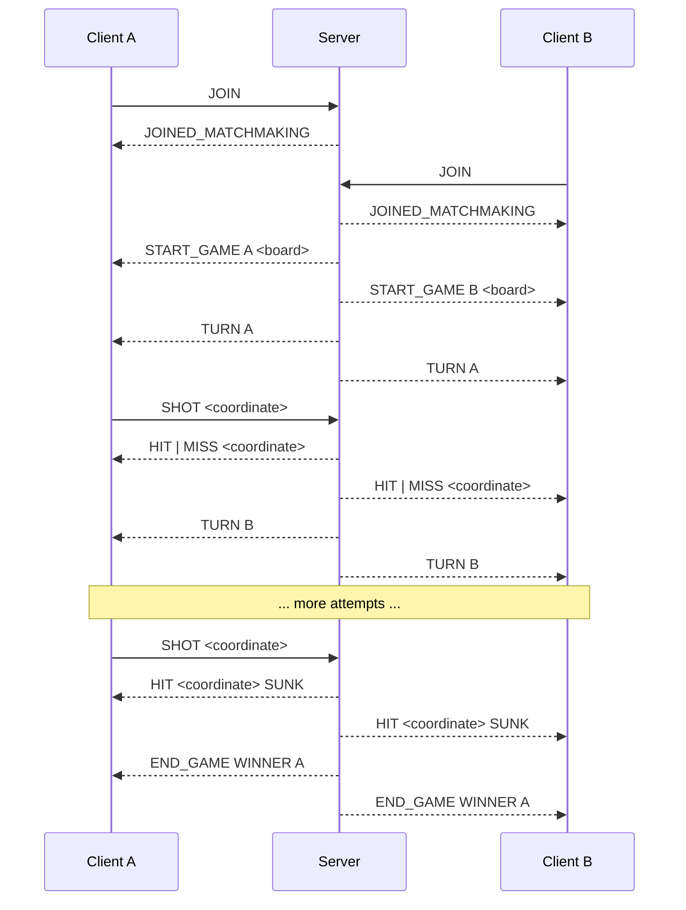
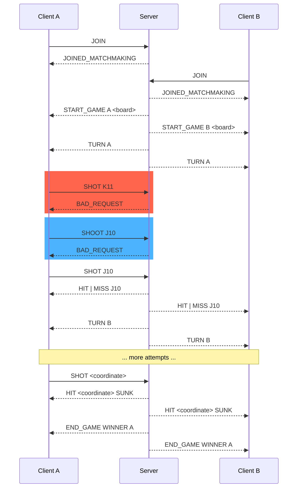
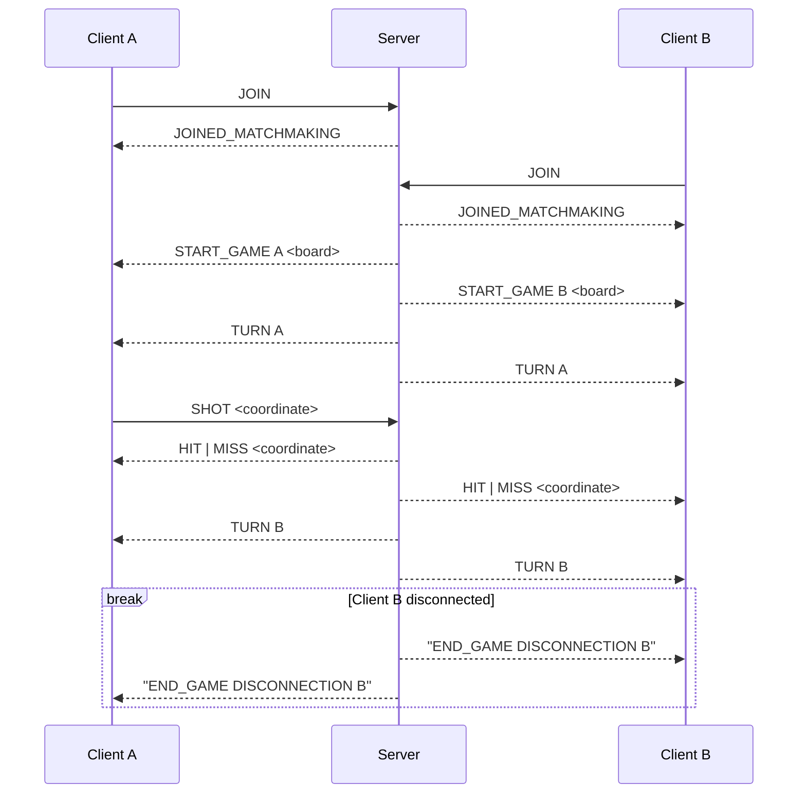
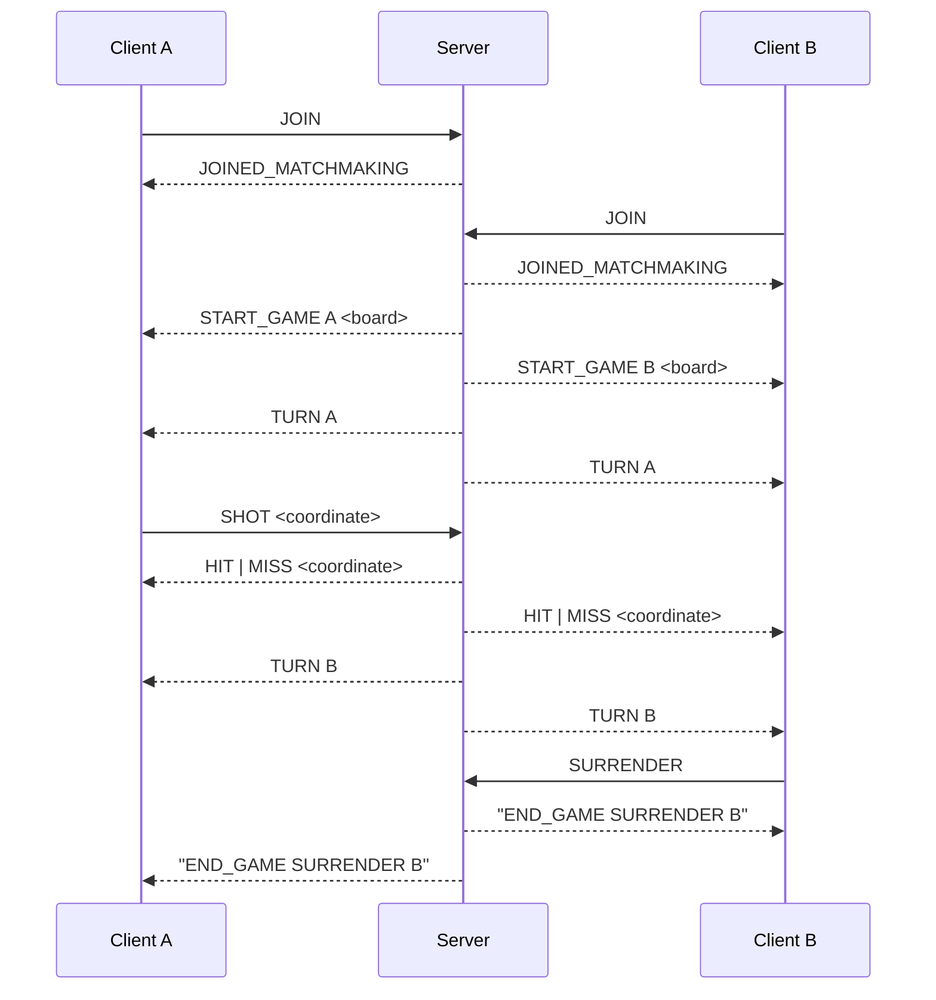
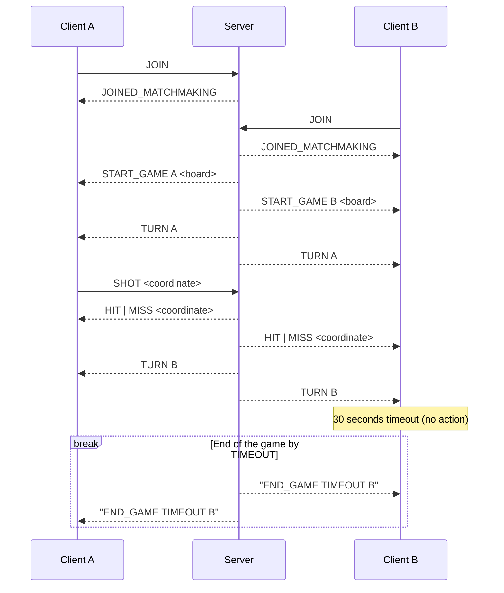
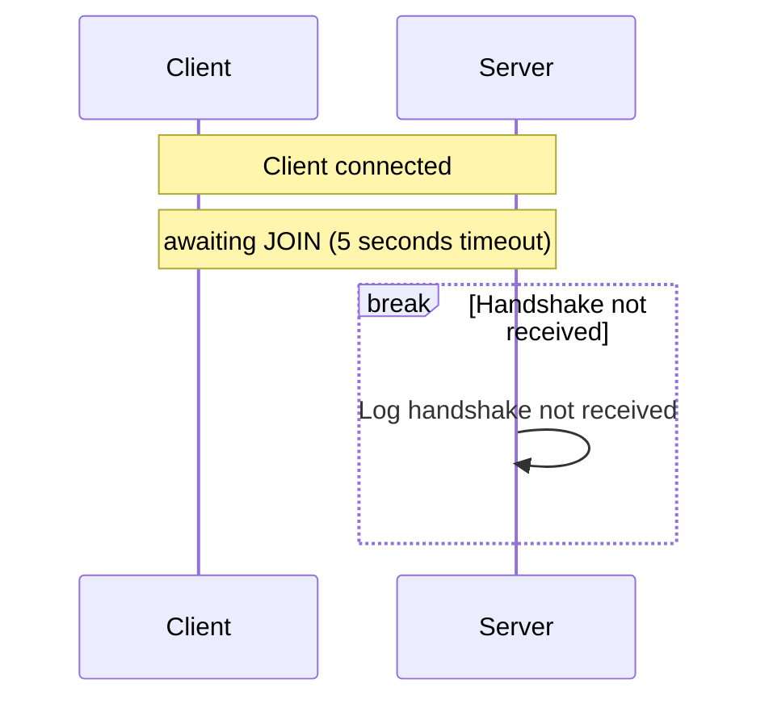
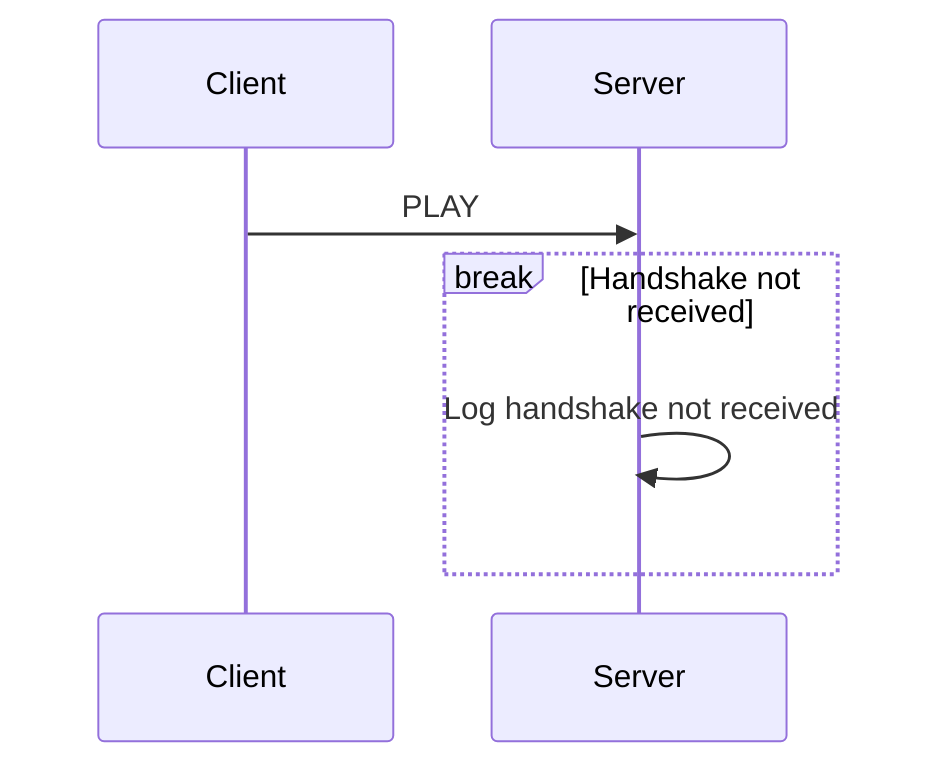

<!-- omit from toc -->
<h1>Battlesocket</h1>
<!-- As HTML tag to prevent it from being included in header numbering. -->

An online multiplayer implementation of the popular Hasbro strategy game. We are
meant to design and implement an application-layer protocol as well as get
ourselves accustomed to the Unix sockets interface.

<!-- omit from toc -->
## Contents

- [1. Features](#1-features)
  - [1.1. Server](#11-server)
  - [1.2. Client](#12-client)
- [2. Protocol](#2-protocol)
  - [2.1. Vocabulary](#21-vocabulary)
    - [2.1.1. Shared by client and server](#211-shared-by-client-and-server)
    - [2.1.2. `BAD_REQUEST`](#212-bad_request)
    - [2.1.3. Server-to-client](#213-server-to-client)
      - [2.1.3.1. `JOINED_MATCHMAKING`](#2131-joined_matchmaking)
      - [2.1.3.2. `START_GAME`](#2132-start_game)
      - [2.1.3.3. `END_GAME`](#2133-end_game)
      - [2.1.3.4. `HIT`](#2134-hit)
      - [2.1.3.5. `MISS`](#2135-miss)
      - [2.1.3.6. `TURN`](#2136-turn)
    - [2.1.4. Client-to-server](#214-client-to-server)
      - [2.1.4.1. `JOIN`](#2141-join)
      - [2.1.4.2. `SHOT`](#2142-shot)
      - [2.1.4.3. `SURRENDER`](#2143-surrender)
  - [2.2. Case examples](#22-case-examples)
    - [2.2.1. Normal development of game](#221-normal-development-of-game)
    - [2.2.2. Bad request](#222-bad-request)
    - [2.2.3. Disconnection](#223-disconnection)
    - [2.2.4. Surrender](#224-surrender)
    - [2.2.5. Timeout](#225-timeout)
    - [2.2.6. No handshake](#226-no-handshake)
    - [2.2.7. Wrong handshake](#227-wrong-handshake)
- [3. Compilation](#3-compilation)
  - [3.1. Server](#31-server)
  - [3.2. Client](#32-client)
- [4. Conclusions](#4-conclusions)
- [5. Authors](#5-authors)
- [6. References](#6-references)
- [7. License](#7-license)


## 1. Features

What's a protocol useful for if there are no programs that implement it?

### 1.1. Server

We wrote a concurrent multi-threaded server in C, using the GNU C library for
common tasks (input/output, string manipulation, etc.) as well as creation and
handling of POSIX threads and input/output multiplexing with `poll()`.

The server accepts incoming connections (after a handshake packet is sent).
It handles matchmaking in a primitive way: using a two-spots FIFO "queue".

After a match starts, a thread is created to handle the game:

- to keep and update its state (the boards of each player, whose turn is it)

- after action messages sent by the players (which are validated by the server
  and logged)

- whose effects are notified to both players (whether it was hit or miss,
  another player disconnected or surrendered, a change of turn, etc.) and logged

- and, when it occurs, tell players who won the match.

In between the match, the server keeps a 30 seconds timer. If the player who has
to shoot doesn't send their shot, it timeouts and the game ends (we preferred this
over continuously switching turns if both players are idle).


### 1.2. Client

The client's remit is:

- To provide a command-line game interface to the player that tells them about:
  - Their own board: Where their ships are and whether they have been hit
  - Their opponent's board: Where they have shot and whether they missed or not
  - Whose turn is it

- To let the player make their shot, surrender, or find a new game.

- To connect to the server using the BSP protocol through message exchanging
  (using the Python Library `sockets` module).

- To detect and notify the player if the client disconnected from the server.


## 2. Protocol

> [!WARNING]
>
> This section is incomplete.

The BattleShip Protocol (BSP) is an application-layer
network communication protocol for Battleship game.
BSP relies on TCP to exchange human-readable text messages
that allow information sharing and event synchronization
between a game server and its clients.

This section defines the semantics of BSP
messages, as well as the procedures regarding them.

### 2.1. Vocabulary

Following the convention suggested in the instructions handout, the BSP messages
follow the structure:

    message = message_type data LF

where LF acts as the message terminator.

Since our game relies on a client-server architecture, some of the messages are
specific to either client or server, and not to its counterpart. Even though, in
theory, a client could send a server-specific message, the protocol procedures
make sure that such cases are handled correctly.

We define some common symbols that are used in the following sections:

    player_letter = "A" | "B"

    coordinate = row col
    row = "A" | "B" | "C" | "D" | "E" | "F" | "G" | "H" | "I" | "J"
    col = "1" | "2" | "3" | "4" | "5" | "6" | "7" | "8" | "9" | "10"

#### 2.1.1. Shared by client and server

#### 2.1.2. `BAD_REQUEST`

Any malformed request (that is, one that is not a valid message of BSP), is
replied to with a `BAD_REQUEST` message.

    bad_request = "BAD_REQUEST"


#### 2.1.3. Server-to-client

##### 2.1.3.1. `JOINED_MATCHMAKING`

When a client joins a game server, we send the following message:

    joined_matchmaking = "JOINED_MATCHMAKING"

##### 2.1.3.2. `START_GAME`

When a game room has been filled, i.e., there are two clients connected, the
server sends a notification to both of them, specifying their letters
and each player's board:

    start_game = "START_GAME" player_letter "{" (ship_type ":" coordinate+)+ "}"

> [!WARNING]
>
> This section is incomplete.

##### 2.1.3.3. `END_GAME`

When a game ends the server notifies each client of the reason for ending
the game. These are the possible reasons to end a game:

1. a player won the game

2. a player disconnected from the server

3. a player sent a surrender message to the server

4. a player didn't send a valid action message on time and thus timed out

Thus we have these possible messages:

    end_game = "END_GAME" cause player_letter
    cause    = "WINNER" | "SURRENDER" | "DISCONNECTION" | "TIMEOUT"

##### 2.1.3.4. `HIT`

When a shot sent by the client results in a hit, the server sends this message
to notify each client of a board update:

    hit = "HIT" coordinate | "HIT" coordinate "SUNK"

##### 2.1.3.5. `MISS`

Similarly, when a shot sent by the client does _not_ result in a hit, the server
sends this message to notify each client of a board update:

    miss = "MISS" coordinate

##### 2.1.3.6. `TURN`

When a player shot sent by a client is processed, it tells both players who
goes next through the following message:

    turn = "TURN" player_letter

#### 2.1.4. Client-to-server

##### 2.1.4.1. `JOIN`

> [!WARNING]
>
> Not fully implemented. Still missing the nickname

A client that wants to connect to a BSP server must send a handshake message to
verify that it's a BSP client and prevent unwanted connections:

    join = "JOIN" nickname

##### 2.1.4.2. `SHOT`

When a player inputs a valid coordinate, the client sends a shot message
with its corresponding values.

    shot = "SHOT" coordinate

##### 2.1.4.3. `SURRENDER`

When a player gives up, the client sends the server a notification with the
following message:

    surrender = "SURRENDER"

### 2.2. Case examples

To illustrate how the protocol, we showcase a non-exhausting collection of UML
sequence diagrams. These include cases for:

1. The "perfect" game, where communication between clients and server occurs
   without issue.

2. The (mostly) unproblematic game, where a few malformed requests are received,
  amounting to no more than petty errors which can be handled.

3. The fatal-error game, where it's no longer possible to keep playing and it's
   terminated by the server.

4. The handshake procedure, which verifies that the client connecting to the
   server is a BSP client.

#### 2.2.1. Normal development of game




#### 2.2.2. Bad request




#### 2.2.3. Disconnection




#### 2.2.4. Surrender




#### 2.2.5. Timeout




#### 2.2.6. No handshake




#### 2.2.7. Wrong handshake




## 3. Compilation

### 3.1. Server

No third-party dependencies.

We are using GNU's `gcc` compiler (specifically, version 11.4.0 on Ubuntu 22.04).

```shell
# Change working directory.
cd battlesocket-server

# Compile.
make -j 4

# Run it with either
make run
# or, to pass *optional* flags, as
./battlesocket-server -p[port] -l[log_file]
```


### 3.2. Client

Written in Python 3 with an embedded third-party.

Tested with Python 3.11.1 on Ubuntu 22.04.

```shell
# Change your working directory to `battlesocket-client`
cd battlesocket-client

# Start Python interpreter on main module.
# *Must* pass IP and port of host.
# (Log path is optional, as it has a default value.)
python src/main.py [server_ip] [server_port] -l [log_path]
```

## 4. Conclusions

We designed an application-layer network communication protocol that works well
to handle a Battleship game. We tried to define it once and for all from the
start, but it took a lot of iterations and nitpicking on details to finally
settle on its design.

During its development, we learned how to use the basic system calls provided by
the Unix `sockets` API. Besides knowing how to interact with this interface, we
had to dig a bit more into the way it's implemented to understand its
limitations and work around them one way or another.

As network applications are typically concurrent, we also learned —despite none
of us having taken a course in operating systems— about threads and,
consequently, about the problem of synchronization which is usually solved
through the use of mutexes or "locks". Trying to understand how mutexes work led
us to learn about atomic operations in computer processors.

In spite of strong suggestion to the contrary, we decided to create a new thread
each time a game started instead of keeping a thread pool. We saw some simple
thread pool implementations but noticed how their higher complexity can carry
along additional problems. These were not worth trying to solve as we had no
real need to handle time-sensitive communications.

## 5. Authors

Jerónimo Acosta Acevedo,
Juan José Restrepo Higuita,
and Luis Miguel Torres Villegas.

## 6. References

1. Hall, Brian. _Beej’s Guide to Network Programming: Using Internet Sockets_.
   2025, https://beej.us/guide/bgnet/.

   Explains how to use the system calls provided by the Unix API for `sockets`
   in a friendly and straightforward way.
   Section 7.2 _`poll()`—Synchronous I/O Multiplexing_ was particularly useful
   in implementing the thread function that handled a game.

2. Blelloch, Guy. _Linux Tutorial: POSIX Threads._ 15-492: Parallel Algorithms
   (Fall 2007),
   https://www.cs.cmu.edu/afs/cs/academic/class/15492-f07/www/pthreads.html.

   Goes over the basic functions provided by the POSIX thread (`pthread`)
   libraries.
   It covers creation, termination, and synchronization using mutexes, among
   other more advanced subjects.

3. Parmaksız, Orhun. _battleship-rs_. 0.1.1, 14 May 2022,
   https://github.com/orhun/battleship-rs.

   Server-side Rust implementation of Battleship. That is, it provides both the
   service _and_ the command-line text interface through a TCP connection (more
   or less like a mainframe interacting with dumb terminals). We designed the
   CLI for our implementation somewhat based off this one.


## 7. License

Copyright 2025 The Authors
